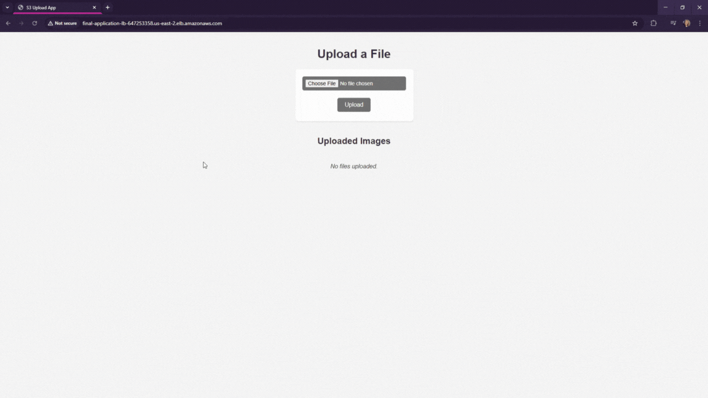

# S3 Upload App

This is a full-stack image upload application built with Node.js and Express that integrates with AWS S3 and AWS Lambda. Users can upload image files through a simple UI. Uploaded files are stored in an S3 bucket, where an AWS Lambda function automatically generates resized thumbnails and saves them to a separate S3 prefix.

## Features

- Upload image files via a web interface
- Store uploaded files in an AWS S3 bucket
- Automatically generate resized images with an AWS Lambda function
- Display thumbnails of resized images
- Use of AWS SDK and CLI for configuration and deployment

## Technologies Used

- **Node.js**
- **Express**
- **AWS S3**
- **AWS Lambda**
- **AWS IAM**
- **AWS CLI**
- **Multer** (for handling multipart/form-data uploads)
- **Sharp** (for image resizing in Lambda)

## How It Works

1. User uploads an image through the frontend form.
2. The Express server handles the request using Multer and sends the image to the `original-images/` prefix in the S3 bucket.
3. The S3 upload triggers a Lambda function.
4. The Lambda function retrieves the image, resizes it using Sharp, and uploads the new version to the `resized-images/` prefix.
5. The frontend fetches and displays the resized image thumbnails from S3.

## Prerequisites

- AWS CLI configured with credentials and correct region
- An existing S3 bucket with appropriate permissions
- A Lambda function set up with access to S3
- Node.js installed locally

## Getting Started

1. Clone the repository:

       git clone https://github.com/raschkatie/s3-upload-app.git
       cd s3-upload-app

2. Install dependencies:

       npm install

3. Create a `.env` file in the root directory with the following values:

       AWS_BUCKET_NAME=your-bucket-name
       AWS_REGION=your-region
       AWS_ACCESS_KEY_ID=your-access-key
       AWS_SECRET_ACCESS_KEY=your-secret-key

4. Run the app locally:

       node server.js

## Screenshots

## License

This project is licensed under the MIT License.
